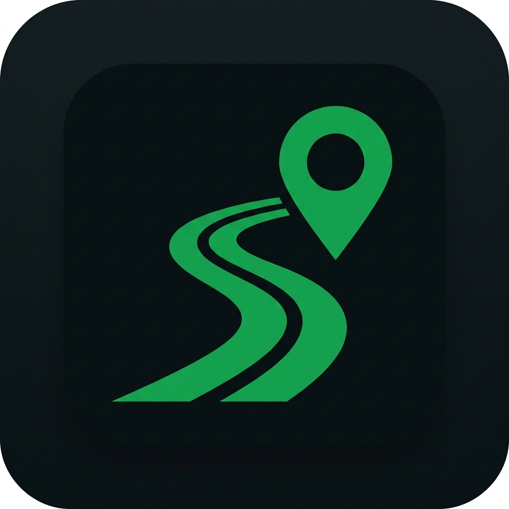

# 🚗 Roadly - Community-Powered Road Safety

[](https://flutter.dev)
[](LICENSE)
[](https://github.com/NavDevs/Roadly-)

**Roadly** is a community-driven mobile application that empowers citizens to report road incidents in real-time, helping fellow drivers and emergency services navigate safely. Built with Flutter, it offers a beautiful, intuitive interface with gamified rewards to encourage active participation.



## ✨ Features

### 🚨 Report Road Issues
- **Accident Reports** - Alert others about vehicle collisions (15 points)
- **Road Work** - Notify about construction and maintenance zones (10 points)
- **Congestion** - Share traffic jam information (5 points)
- **Blocked Roads** - Report road blockages from fallen trees, floods, etc. (20 points)

### 🗺️ Interactive Map
- Real-time visualization of nearby incidents
- Location-based reporting with automatic GPS detection
- Distance indicators for each report

### 🏆 Gamification & Rewards
- **Points System**: Earn points for every verified report
- **Badges**: Unlock achievements (First Report, Verified, 100 Pts, 500 Pts, Top Reporter)
- **Leaderboard**: Compete with other community members weekly
- **Rank System**: Climb the ranks based on your contributions

### 📱 User Experience
- **Dark Theme**: Eye-friendly interface with modern Material Design 3
- **Phone Authentication**: Simple login with mobile number
- **Quick Reporting**: Submit reports in under 30 seconds
- **Photo Evidence**: Attach images to speed up verification
- **Report History**: Track all your submitted reports

## 🛠️ Tech Stack

| Component | Technology |
|-----------|------------|
| **Framework** | Flutter 3.9+ |
| **Language** | Dart |
| **State Management** | Provider |
| **Local Storage** | Shared Preferences |
| **Location Services** | Geolocator |
| **Image Picker** | Image Picker |
| **Fonts** | Google Fonts (Inter) |
| **Icons** | Material Icons + Cupertino Icons |
| **Permissions** | Permission Handler |

## 📁 Project Structure

```
roadly_flutter/
├── android/              # Android platform files
├── ios/                  # iOS platform files
├── lib/
│   ├── constants/        # App constants (colors, report types)
│   ├── models/           # Data models (Report, Location)
│   ├── providers/        # State management (AppProvider)
│   ├── screens/          # UI screens
│   │   ├── home_screen.dart      # Main dashboard
│   │   ├── report_screen.dart    # Submit reports
│   │   ├── history_screen.dart   # Report history
│   │   ├── rewards_screen.dart   # Points & leaderboard
│   │   ├── profile_screen.dart   # User profile
│   │   ├── login_screen.dart     # Authentication
│   │   └── tabs_screen.dart      # Bottom navigation
│   ├── widgets/          # Reusable UI components
│   ├── utils/            # Utility functions
│   └── main.dart         # App entry point
├── assets/               # Images and static resources
├── pubspec.yaml          # Dependencies
└── README.md             # This file
```

## 🚀 Getting Started

### Prerequisites
- [Flutter SDK](https://flutter.dev/docs/get-started/install) (3.9.0 or higher)
- [Android Studio](https://developer.android.com/studio) or [VS Code](https://code.visualstudio.com/)
- Android SDK (for Android builds)
- Xcode (for iOS builds, macOS only)

### Installation

1. **Clone the repository**
   ```bash
   git clone https://github.com/NavDevs/Roadly-.git
   cd Roadly-
   ```

2. **Install dependencies**
   ```bash
   flutter pub get
   ```

3. **Run the app**
   ```bash
   # For Android
   flutter run

   # For specific device
   flutter run -d <device_id>
   ```

### Building for Production

#### Android APK
```bash
flutter build apk --release
```
The APK will be located at: `build/app/outputs/flutter-apk/app-release.apk`

#### Android App Bundle (for Play Store)
```bash
flutter build appbundle --release
```

#### iOS
```bash
flutter build ios --release
```

## 📸 Screenshots

| Home | Report | Rewards |
|------|--------|---------|
| Dashboard with map | Submit incident | Points & badges |

## 🤝 How It Works

1. **Login**: Enter your mobile number to get started
2. **Explore**: View nearby road incidents on the home screen
3. **Report**: Tap the red button to report a new incident
4. **Select**: Choose incident type (Accident, Road Work, Congestion, Blocked)
5. **Details**: Add description and optional photo
6. **Submit**: Report goes live instantly
7. **Earn**: Collect points and climb the leaderboard

## 🔐 Permissions

Roadly requires the following permissions:
- **Location**: To detect your current position for accurate reporting
- **Camera/Storage**: To attach photo evidence to reports

## 🎯 Use Cases

- **Daily Commuters**: Avoid traffic jams and road closures
- **Emergency Services**: Get real-time incident data
- **City Planners**: Identify problematic road segments
- **Ride-sharing Drivers**: Navigate efficiently around incidents
- **Motorcyclists**: Stay informed about road hazards

## 🛣️ Roadmap

- [ ] Push notifications for nearby incidents
- [ ] Integration with Google Maps / OpenStreetMap
- [ ] Backend API with real-time updates
- [ ] Multi-language support
- [ ] Offline mode
- [ ] Municipal authority dashboard
- [ ] Integration with emergency services

## 📲 Download

Get the latest APK from the [Releases](https://github.com/NavDevs/Roadly-/releases) section.

## 🤝 Contributing

Contributions are welcome! Please feel free to submit a Pull Request.

1. Fork the repository
2. Create your feature branch (`git checkout -b feature/AmazingFeature`)
3. Commit your changes (`git commit -m 'Add some AmazingFeature'`)
4. Push to the branch (`git push origin feature/AmazingFeature`)
5. Open a Pull Request

## 📄 License

This project is licensed under the MIT License - see the [LICENSE](LICENSE) file for details.

## 👨‍💻 Author

**NavDevs** - [GitHub](https://github.com/NavDevs)

---

<p align="center">Made with ❤️ and Flutter</p>
